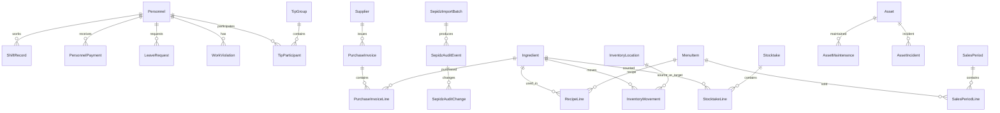

# شماتیک ساختار داده رایو برای مهاجرت به SQL Server

**نسخه مرجع:** Rayo Admin v10.8.0  
**هدف:** این سند از روی سورس نسخه 10.8.0، Seedهای موجود و مسیرهای واقعی ایجاد/ویرایش رکوردها تهیه شده و برای طراحی دیتابیس رابطه‌ای، تولید Promptهای ساخت DDL، Query، Migration و API قابل استفاده است.

> این سند دو سطح را جدا می‌کند: **Current JSON Model** که وضعیت فعلی پنل است و **Recommended Relational Model** که طرح پیشنهادی برای SQL Server است. جدول‌های پیشنهادی به معنی وجود فعلی SQL Server نیستند.

## 1. معماری داده فعلی

Frontend با API زیر کار می‌کند:

```text
GET  /api/v1.0/RayoData/Load?module=<module>
POST /api/v1.0/RayoData/Save?module=<module>
```

ماژول‌های فعلی:

| Frontend key | Backend module | حوزه |
|---|---|---|
| `hr` | `personnel` | منابع انسانی و پرسنل |
| `suppliers` | `suppliers` | تأمین‌کنندگان و خرید |
| `pricing` | `pricing` | قیمت‌گذاری، مواد اولیه و رسپی |
| `inventory` | `inventory` | انبار و کنترل مصرف |
| `cashreport` | `cashreport` | صندوق و تحلیل فروش |
| `assets` | `assets` | اموال و دارایی |
| `finance` | `finance` | مالی |
| `survey` | `survey` | نظرسنجی |
| `errorlog` | `errorlog` | لاگ خطا |
| `sepidsaudit` | `sepidsaudit` | ممیزی سپیدز |

در نسخه 10.8.0، Load عادی فقط API را می‌خواند. Seed فقط با اقدام صریح مدیر برای **بارگذاری اطلاعات اولیه** یا **بازنشانی از اطلاعات اولیه** قابل استفاده است و در Runtime عادی هیچ مسیر خودکاری برای نوشتن Seed وجود ندارد.

## 2. اصول پیشنهادی SQL Server

- کلیدهای فعلی مانند `EMP-0001`, `ING-1001`, `MENU-101` در مهاجرت اول حفظ شوند؛ می‌توان در کنار آنها یک `bigint identity` داخلی هم داشت.
- همه جدول‌های عملیاتی بهتر است `CreatedAt`, `CreatedBy`, `UpdatedAt`, `UpdatedBy`, `Status`, `IsArchived` داشته باشند، حتی اگر در JSON فعلی بعضی از آنها وجود ندارد.
- مبلغ‌ها به‌صورت `bigint` یا `decimal(18,3)` و با واحد صریح **تومان** ذخیره شوند. فقط ورودی‌های تاریخی ریالی در لایه Import تبدیل شوند.
- تاریخ‌های عملیاتی فعلی شمسی `YYYY/MM/DD` هستند. برای SQL توصیه می‌شود هم `JalaliDateText char(10)` و هم تاریخ میلادی معادل `date` نگهداری شود تا Query/Index استاندارد باشد.
- مقادیر Enum مانند وضعیت، سکشن، نوع حرکت و نوع پرداخت در فاز اول `nvarchar` بمانند؛ بعداً در صورت ثبات می‌توان Lookup Table ساخت.
- Password فعلی پرسنل در JSON به‌صورت متن ساده نگهداری شده است؛ در SQL Server **نباید** منتقل شود. فقط `PasswordHash` + Salt/ASP.NET Identity یا سرویس Auth استاندارد.
- آرایه‌های Nested مانند `tipGroups.participants`, `purchaseInvoices.lines`, `stocktakes.lines` و `checklistTemplates.items` باید به Child Table مستقل تبدیل شوند.
- `ChangeLog`های پراکنده بهتر است در آینده به Audit Log مرکزی یا Temporal Tables منتقل شوند.

## 3. ERD سطح بالا



## 4. کاتالوگ جدول‌های پیشنهادی

### 4.1. منابع انسانی و پرسنل — `hr` / Backend `personnel`

#### `Personnel`

- مسیر فعلی JSON: `hr.personnel`
- Primary Key پیشنهادی: `Id`
- سطح اطمینان: `observed+proposed`

| ستون | SQL Type | Null | منبع/وضعیت | توضیح |
|---|---|---|---|---|
| `Id` | `nvarchar(30)` | خیر | observed |  |
| `Name` | `nvarchar(150)` | خیر | observed |  |
| `MainPosition` | `nvarchar(100)` | بله | observed |  |
| `BackupPosition` | `nvarchar(100)` | بله | observed |  |
| `PersonnelGroup` | `nvarchar(100)` | بله | observed |  |
| `Section` | `nvarchar(100)` | بله | observed |  |
| `SubSection` | `nvarchar(100)` | بله | observed |  |
| `Nationality` | `nvarchar(50)` | بله | observed |  |
| `InsuranceStatus` | `nvarchar(50)` | بله | observed |  |
| `StartDateJalali` | `char(10)` | بله | observed |  |
| `Phone` | `nvarchar(30)` | بله | observed |  |
| `EmploymentType` | `nvarchar(50)` | بله | observed |  |
| `EmploymentStatus` | `nvarchar(50)` | بله | observed |  |
| `TransportMonthlyToman` | `bigint` | بله | observed |  |
| `FixedAllowanceToman` | `bigint` | بله | observed |  |
| `HourlyRateToman` | `bigint` | بله | observed |  |
| `MonthlyCreditToman` | `bigint` | بله | observed |  |
| `MealCreditToman` | `bigint` | بله | observed |  |
| `GradeId` | `nvarchar(10)` | بله | observed |  |
| `ExperienceMonths` | `int` | بله | observed |  |
| `BankName` | `nvarchar(100)` | بله | observed |  |
| `AccountHolderName` | `nvarchar(150)` | بله | observed |  |
| `AccountNumber` | `nvarchar(50)` | بله | observed |  |
| `CardNumber` | `nvarchar(30)` | بله | observed |  |
| `Iban` | `nvarchar(34)` | بله | observed |  |
| `Notes` | `nvarchar(max)` | بله | observed |  |
| `CreatedAt` | `datetime2` | بله | proposed |  |
| `UpdatedAt` | `datetime2` | بله | observed/proposed |  |
| `IsArchived` | `bit` | بله | proposed |  |

#### `PersonnelUserAccess`

- مسیر فعلی JSON: `hr.personnel[].username/userPassword/userAccess`
- Primary Key پیشنهادی: `Id`
- سطح اطمینان: `observed+proposed`

- نکته: Do not carry plaintext passwords into SQL Server.

| ستون | SQL Type | Null | منبع/وضعیت | توضیح |
|---|---|---|---|---|
| `PersonnelId` | `nvarchar(30)` | خیر | observed |  |
| `Username` | `nvarchar(100)` | بله | observed |  |
| `PasswordHash` | `varbinary(512)` | بله | proposed | Current frontend stores plaintext userPassword; migrate to server-side hash. |
| `IsEnabled` | `bit` | بله | observed |  |
| `UpdatedAt` | `datetime2` | بله | observed |  |

#### `PersonnelPermission`

- مسیر فعلی JSON: `hr.personnel[].userAccess.permissions`
- Primary Key پیشنهادی: `(PersonnelId,PermissionCode)`
- سطح اطمینان: `observed+proposed`

| ستون | SQL Type | Null | منبع/وضعیت | توضیح |
|---|---|---|---|---|
| `PersonnelId` | `nvarchar(30)` | خیر | observed |  |
| `PermissionCode` | `nvarchar(80)` | خیر | observed |  |
| `IsAllowed` | `bit` | خیر | observed |  |

#### `WeeklyPlan`

- مسیر فعلی JSON: `hr.weeklyPlans`
- Primary Key پیشنهادی: `Id`
- سطح اطمینان: `observed+proposed`

- نکته: Current cells object should normalize into WeeklyPlanAssignment.

| ستون | SQL Type | Null | منبع/وضعیت | توضیح |
|---|---|---|---|---|
| `Id` | `nvarchar(30)` | خیر | observed |  |
| `WeekStartJalali` | `char(10)` | خیر | observed |  |
| `Notes` | `nvarchar(max)` | بله | observed |  |
| `CreatedAt` | `datetime2` | بله | proposed |  |
| `UpdatedAt` | `datetime2` | بله | proposed |  |

#### `WeeklyPlanAssignment`

- مسیر فعلی JSON: `hr.weeklyPlans[].cells`
- Primary Key پیشنهادی: `Id`
- سطح اطمینان: `observed+proposed`

| ستون | SQL Type | Null | منبع/وضعیت | توضیح |
|---|---|---|---|---|
| `Id` | `bigint` | خیر | proposed |  |
| `WeeklyPlanId` | `nvarchar(30)` | خیر | observed |  |
| `DayIndex` | `tinyint` | خیر | observed |  |
| `Shift` | `nvarchar(30)` | خیر | observed |  |
| `Section` | `nvarchar(100)` | بله | observed |  |
| `Position` | `nvarchar(100)` | بله | observed |  |
| `PersonnelId` | `nvarchar(30)` | خیر | observed |  |

#### `MonthlyPlan`

- مسیر فعلی JSON: `hr.monthlyPlans`
- Primary Key پیشنهادی: `Id`
- سطح اطمینان: `observed+proposed`

- نکته: Current cells object should normalize into MonthlyPlanAssignment.

| ستون | SQL Type | Null | منبع/وضعیت | توضیح |
|---|---|---|---|---|
| `Id` | `nvarchar(30)` | خیر | observed |  |
| `YearJalali` | `smallint` | خیر | observed |  |
| `MonthJalali` | `tinyint` | خیر | observed |  |
| `Notes` | `nvarchar(max)` | بله | observed |  |
| `CopiedFrom` | `nvarchar(50)` | بله | observed |  |
| `CreatedAt` | `datetime2` | بله | observed |  |
| `UpdatedAt` | `datetime2` | بله | observed |  |

#### `MonthlyPlanAssignment`

- مسیر فعلی JSON: `hr.monthlyPlans[].cells`
- Primary Key پیشنهادی: `Id`
- سطح اطمینان: `observed+proposed`

| ستون | SQL Type | Null | منبع/وضعیت | توضیح |
|---|---|---|---|---|
| `Id` | `bigint` | خیر | proposed |  |
| `MonthlyPlanId` | `nvarchar(30)` | خیر | observed |  |
| `DateJalali` | `char(10)` | خیر | observed |  |
| `Shift` | `nvarchar(30)` | خیر | observed |  |
| `Section` | `nvarchar(100)` | بله | observed |  |
| `Position` | `nvarchar(100)` | بله | observed |  |
| `PersonnelId` | `nvarchar(30)` | خیر | observed |  |

#### `ShiftRecord`

- مسیر فعلی JSON: `hr.shiftRecords`
- Primary Key پیشنهادی: `Id`
- سطح اطمینان: `observed+proposed`

| ستون | SQL Type | Null | منبع/وضعیت | توضیح |
|---|---|---|---|---|
| `Id` | `nvarchar(30)` | خیر | observed |  |
| `DateJalali` | `char(10)` | خیر | observed |  |
| `PersonnelId` | `nvarchar(30)` | خیر | observed |  |
| `Shift` | `nvarchar(30)` | بله | observed |  |
| `Position` | `nvarchar(100)` | بله | observed |  |
| `Section` | `nvarchar(100)` | بله | observed |  |
| `Status` | `nvarchar(50)` | بله | observed |  |
| `ScheduledHours` | `decimal(8,2)` | بله | observed |  |
| `ActualHours` | `decimal(8,2)` | بله | observed |  |
| `Notes` | `nvarchar(max)` | بله | observed |  |

#### `StaffingRequirement`

- مسیر فعلی JSON: `hr.staffingRequirements`
- Primary Key پیشنهادی: `Id`
- سطح اطمینان: `observed+proposed`

| ستون | SQL Type | Null | منبع/وضعیت | توضیح |
|---|---|---|---|---|
| `Id` | `nvarchar(30)` | خیر | observed |  |
| `DayIndex` | `tinyint` | خیر | observed |  |
| `Shift` | `nvarchar(30)` | خیر | observed |  |
| `Section` | `nvarchar(100)` | خیر | observed |  |
| `Position` | `nvarchar(100)` | خیر | observed |  |
| `RequiredCount` | `decimal(8,2)` | خیر | observed |  |
| `IsActive` | `bit` | خیر | observed |  |

#### `Holiday`

- مسیر فعلی JSON: `hr.holidays`
- Primary Key پیشنهادی: `Id`
- سطح اطمینان: `observed+proposed`

| ستون | SQL Type | Null | منبع/وضعیت | توضیح |
|---|---|---|---|---|
| `Id` | `nvarchar(30)` | خیر | proposed |  |
| `DateJalali` | `char(10)` | خیر | observed |  |
| `Title` | `nvarchar(150)` | بله | observed |  |
| `IsActive` | `bit` | خیر | observed |  |

#### `TipGroup`

- مسیر فعلی JSON: `hr.tipGroups`
- Primary Key پیشنهادی: `Id`
- سطح اطمینان: `observed+proposed`

| ستون | SQL Type | Null | منبع/وضعیت | توضیح |
|---|---|---|---|---|
| `Id` | `nvarchar(40)` | خیر | observed |  |
| `ReceiveDateJalali` | `char(10)` | خیر | observed |  |
| `Type` | `nvarchar(50)` | بله | observed |  |
| `HallGroup` | `nvarchar(100)` | بله | observed |  |
| `TotalAmountToman` | `bigint` | خیر | observed |  |
| `ReceiveMethod` | `nvarchar(100)` | بله | observed |  |
| `Status` | `nvarchar(50)` | بله | observed |  |
| `SettledAmountToman` | `bigint` | بله | observed |  |
| `SettlementDateJalali` | `char(10)` | بله | observed |  |
| `SettlementMethod` | `nvarchar(100)` | بله | observed |  |
| `Notes` | `nvarchar(max)` | بله | observed |  |
| `CreatedAt` | `datetime2` | بله | observed |  |
| `CreatedByPersonnelId` | `nvarchar(30)` | بله | observed |  |

#### `TipParticipant`

- مسیر فعلی JSON: `hr.tipGroups[].participants`
- Primary Key پیشنهادی: `(TipGroupId,PersonnelId)`
- سطح اطمینان: `observed+proposed`

| ستون | SQL Type | Null | منبع/وضعیت | توضیح |
|---|---|---|---|---|
| `TipGroupId` | `nvarchar(40)` | خیر | observed |  |
| `PersonnelId` | `nvarchar(30)` | خیر | observed |  |
| `Weight` | `decimal(12,4)` | خیر | observed |  |
| `CalculatedShareToman` | `bigint` | بله | proposed |  |

#### `PenaltyReward`

- مسیر فعلی JSON: `hr.penaltiesRewards`
- Primary Key پیشنهادی: `Id`
- سطح اطمینان: `observed+proposed`

| ستون | SQL Type | Null | منبع/وضعیت | توضیح |
|---|---|---|---|---|
| `Id` | `nvarchar(30)` | خیر | observed |  |
| `DateJalali` | `char(10)` | خیر | observed |  |
| `PersonnelId` | `nvarchar(30)` | خیر | observed |  |
| `Type` | `nvarchar(30)` | خیر | observed |  |
| `AmountToman` | `bigint` | خیر | observed |  |
| `Reason` | `nvarchar(max)` | بله | observed |  |
| `Status` | `nvarchar(50)` | بله | observed |  |
| `ApprovedBy` | `nvarchar(150)` | بله | observed |  |
| `Source` | `nvarchar(50)` | بله | observed |  |
| `SourceId` | `nvarchar(40)` | بله | observed |  |
| `Notes` | `nvarchar(max)` | بله | observed |  |
| `CreatedAt` | `datetime2` | بله | observed |  |

#### `WorkViolation`

- مسیر فعلی JSON: `hr.workViolations`
- Primary Key پیشنهادی: `Id`
- سطح اطمینان: `observed+proposed`

| ستون | SQL Type | Null | منبع/وضعیت | توضیح |
|---|---|---|---|---|
| `Id` | `nvarchar(30)` | خیر | observed |  |
| `DateJalali` | `char(10)` | خیر | observed |  |
| `PersonnelId` | `nvarchar(30)` | خیر | observed |  |
| `ViolationType` | `nvarchar(120)` | خیر | observed |  |
| `Details` | `nvarchar(max)` | بله | observed |  |
| `WarningGiven` | `bit` | بله | observed |  |
| `WarningText` | `nvarchar(max)` | بله | observed |  |
| `HasFine` | `bit` | بله | observed |  |
| `FineAmountToman` | `bigint` | بله | observed |  |
| `PenaltyId` | `nvarchar(30)` | بله | observed |  |
| `RegisteredBy` | `nvarchar(150)` | بله | observed |  |
| `CreatedAt` | `datetime2` | بله | observed |  |
| `UpdatedAt` | `datetime2` | بله | observed |  |

#### `DelayRecord`

- مسیر فعلی JSON: `hr.delays`
- Primary Key پیشنهادی: `Id`
- سطح اطمینان: `observed+proposed`

| ستون | SQL Type | Null | منبع/وضعیت | توضیح |
|---|---|---|---|---|
| `Id` | `nvarchar(30)` | خیر | observed |  |
| `DateJalali` | `char(10)` | خیر | observed |  |
| `YearJalali` | `smallint` | بله | observed |  |
| `MonthJalali` | `tinyint` | بله | observed |  |
| `PersonnelId` | `nvarchar(30)` | خیر | observed |  |
| `Type` | `nvarchar(50)` | بله | observed |  |
| `Shift` | `nvarchar(30)` | بله | observed |  |
| `ScheduledTime` | `time` | بله | observed |  |
| `ActualTime` | `time` | بله | observed |  |
| `Notes` | `nvarchar(max)` | بله | observed |  |

#### `PersonnelPayment`

- مسیر فعلی JSON: `hr.payments`
- Primary Key پیشنهادی: `Id`
- سطح اطمینان: `observed+proposed`

| ستون | SQL Type | Null | منبع/وضعیت | توضیح |
|---|---|---|---|---|
| `Id` | `nvarchar(30)` | خیر | observed |  |
| `DateJalali` | `char(10)` | خیر | observed |  |
| `SalaryYearJalali` | `smallint` | بله | observed |  |
| `SalaryMonthJalali` | `tinyint` | بله | observed |  |
| `PersonnelId` | `nvarchar(30)` | خیر | observed |  |
| `Type` | `nvarchar(80)` | بله | observed |  |
| `AmountToman` | `bigint` | خیر | observed |  |
| `Method` | `nvarchar(80)` | بله | observed |  |
| `SourceAccount` | `nvarchar(150)` | بله | observed |  |
| `Tracking` | `nvarchar(100)` | بله | observed |  |
| `RegisteredBy` | `nvarchar(150)` | بله | observed |  |
| `ReferenceCode` | `nvarchar(100)` | بله | observed |  |
| `Status` | `nvarchar(50)` | بله | observed |  |
| `Source` | `nvarchar(50)` | بله | observed |  |
| `SourceId` | `nvarchar(40)` | بله | observed |  |
| `Notes` | `nvarchar(max)` | بله | observed |  |
| `CreatedAt` | `datetime2` | بله | observed |  |

#### `PersonnelConsumption`

- مسیر فعلی JSON: `hr.consumptions`
- Primary Key پیشنهادی: `Id`
- سطح اطمینان: `observed+proposed`

| ستون | SQL Type | Null | منبع/وضعیت | توضیح |
|---|---|---|---|---|
| `Id` | `nvarchar(30)` | خیر | observed |  |
| `DateJalali` | `char(10)` | خیر | observed |  |
| `YearJalali` | `smallint` | بله | observed |  |
| `MonthJalali` | `tinyint` | بله | observed |  |
| `PersonnelId` | `nvarchar(30)` | خیر | observed |  |
| `Type` | `nvarchar(50)` | بله | observed |  |
| `AmountToman` | `bigint` | خیر | observed |  |
| `Notes` | `nvarchar(max)` | بله | observed |  |

#### `LeaveRecord`

- مسیر فعلی JSON: `hr.leaves`
- Primary Key پیشنهادی: `Id`
- سطح اطمینان: `observed+proposed`

| ستون | SQL Type | Null | منبع/وضعیت | توضیح |
|---|---|---|---|---|
| `Id` | `nvarchar(30)` | خیر | observed |  |
| `PersonnelId` | `nvarchar(30)` | خیر | observed |  |
| `Type` | `nvarchar(80)` | بله | observed |  |
| `FromDateJalali` | `char(10)` | خیر | observed |  |
| `ToDateJalali` | `char(10)` | بله | observed |  |
| `Count` | `decimal(8,2)` | بله | observed |  |
| `Notes` | `nvarchar(max)` | بله | observed |  |
| `Status` | `nvarchar(50)` | بله | proposed |  |

#### `LeaveRequest`

- مسیر فعلی JSON: `hr.leaveRequests`
- Primary Key پیشنهادی: `Id`
- سطح اطمینان: `observed+proposed`

| ستون | SQL Type | Null | منبع/وضعیت | توضیح |
|---|---|---|---|---|
| `Id` | `nvarchar(30)` | خیر | observed |  |
| `PersonnelId` | `nvarchar(30)` | خیر | observed |  |
| `Type` | `nvarchar(80)` | بله | observed |  |
| `FromDateJalali` | `char(10)` | خیر | observed |  |
| `ToDateJalali` | `char(10)` | خیر | observed |  |
| `Count` | `decimal(8,2)` | بله | observed |  |
| `Notes` | `nvarchar(max)` | بله | observed |  |
| `Status` | `nvarchar(50)` | بله | observed |  |
| `ManagerNote` | `nvarchar(max)` | بله | observed |  |
| `CreatedAt` | `datetime2` | بله | observed |  |
| `ReviewedAt` | `datetime2` | بله | proposed |  |

#### `AdvanceRequest`

- مسیر فعلی JSON: `hr.advanceRequests`
- Primary Key پیشنهادی: `Id`
- سطح اطمینان: `observed+proposed`

| ستون | SQL Type | Null | منبع/وضعیت | توضیح |
|---|---|---|---|---|
| `Id` | `nvarchar(30)` | خیر | observed |  |
| `DateJalali` | `char(10)` | خیر | observed |  |
| `PersonnelId` | `nvarchar(30)` | خیر | observed |  |
| `AmountToman` | `bigint` | خیر | observed |  |
| `Notes` | `nvarchar(max)` | بله | observed |  |
| `Status` | `nvarchar(50)` | بله | observed |  |
| `ManagerNote` | `nvarchar(max)` | بله | observed |  |
| `PaymentId` | `nvarchar(30)` | بله | observed |  |
| `CreatedAt` | `datetime2` | بله | observed |  |
| `ReviewedAt` | `datetime2` | بله | observed |  |

#### `PayrollClosure`

- مسیر فعلی JSON: `hr.payrollClosures`
- Primary Key پیشنهادی: `Id`
- سطح اطمینان: `observed+proposed`

- نکته: Nested rows/payments should be separate snapshot tables.

| ستون | SQL Type | Null | منبع/وضعیت | توضیح |
|---|---|---|---|---|
| `Id` | `nvarchar(30)` | خیر | observed |  |
| `YearJalali` | `smallint` | خیر | observed |  |
| `MonthJalali` | `tinyint` | خیر | observed |  |
| `Version` | `int` | خیر | observed |  |
| `IsActive` | `bit` | خیر | observed |  |
| `FinalizedAt` | `datetime2` | بله | observed |  |
| `FinalizedBy` | `nvarchar(150)` | بله | observed |  |
| `Notes` | `nvarchar(max)` | بله | observed |  |
| `TotalNetToman` | `bigint` | بله | observed |  |
| `TotalPaidToman` | `bigint` | بله | observed |  |
| `TotalUnpaidToman` | `bigint` | بله | observed |  |

#### `PayrollClosureRow`

- مسیر فعلی JSON: `hr.payrollClosures[].rows`
- Primary Key پیشنهادی: `Id`
- سطح اطمینان: `observed+proposed`

| ستون | SQL Type | Null | منبع/وضعیت | توضیح |
|---|---|---|---|---|
| `Id` | `bigint` | خیر | proposed |  |
| `PayrollClosureId` | `nvarchar(30)` | خیر | observed |  |
| `PersonnelId` | `nvarchar(30)` | خیر | observed |  |
| `SnapshotJson` | `nvarchar(max)` | بله | proposed | Phase-1 safe option; later normalize payroll calculation fields. |

#### `ProtocolGroup`

- مسیر فعلی JSON: `hr.lists.protocolGroups`
- Primary Key پیشنهادی: `Id`
- سطح اطمینان: `observed+proposed`

| ستون | SQL Type | Null | منبع/وضعیت | توضیح |
|---|---|---|---|---|
| `Id` | `nvarchar(30)` | خیر | observed |  |
| `Name` | `nvarchar(120)` | خیر | observed |  |

#### `Protocol`

- مسیر فعلی JSON: `hr.protocols`
- Primary Key پیشنهادی: `Id`
- سطح اطمینان: `observed+proposed`

| ستون | SQL Type | Null | منبع/وضعیت | توضیح |
|---|---|---|---|---|
| `Id` | `nvarchar(30)` | خیر | observed |  |
| `Title` | `nvarchar(200)` | خیر | observed |  |
| `Type` | `nvarchar(50)` | بله | observed |  |
| `GroupId` | `nvarchar(30)` | بله | observed |  |
| `Content` | `nvarchar(max)` | خیر | observed |  |
| `AudienceAll` | `bit` | خیر | observed |  |
| `IsActive` | `bit` | خیر | observed |  |
| `CreatedAt` | `datetime2` | بله | observed |  |
| `UpdatedAt` | `datetime2` | بله | observed |  |

#### `ProtocolAudienceSection`

- مسیر فعلی JSON: `hr.protocols[].audienceSections`
- Primary Key پیشنهادی: `(ProtocolId,Section)`
- سطح اطمینان: `observed+proposed`

| ستون | SQL Type | Null | منبع/وضعیت | توضیح |
|---|---|---|---|---|
| `ProtocolId` | `nvarchar(30)` | خیر | observed |  |
| `Section` | `nvarchar(100)` | خیر | observed |  |

#### `ChecklistTemplate`

- مسیر فعلی JSON: `hr.checklistTemplates`
- Primary Key پیشنهادی: `Id`
- سطح اطمینان: `observed+proposed`

| ستون | SQL Type | Null | منبع/وضعیت | توضیح |
|---|---|---|---|---|
| `Id` | `nvarchar(30)` | خیر | observed |  |
| `Name` | `nvarchar(200)` | خیر | observed |  |
| `Mode` | `nvarchar(40)` | بله | observed |  |
| `Section` | `nvarchar(100)` | بله | observed |  |
| `IsActive` | `bit` | بله | observed |  |
| `CreatedAt` | `datetime2` | بله | observed |  |
| `UpdatedAt` | `datetime2` | بله | observed |  |

#### `ChecklistTemplateItem`

- مسیر فعلی JSON: `hr.checklistTemplates[].items`
- Primary Key پیشنهادی: `Id`
- سطح اطمینان: `observed+proposed`

| ستون | SQL Type | Null | منبع/وضعیت | توضیح |
|---|---|---|---|---|
| `Id` | `nvarchar(50)` | خیر | observed |  |
| `ChecklistTemplateId` | `nvarchar(30)` | خیر | observed |  |
| `Stage` | `nvarchar(30)` | خیر | observed |  |
| `Text` | `nvarchar(500)` | خیر | observed |  |
| `SortOrder` | `int` | بله | proposed |  |

#### `ChecklistTemplateResponsible`

- مسیر فعلی JSON: `hr.checklistTemplates[].responsiblePersonnelIds`
- Primary Key پیشنهادی: `(ChecklistTemplateId,PersonnelId)`
- سطح اطمینان: `observed+proposed`

| ستون | SQL Type | Null | منبع/وضعیت | توضیح |
|---|---|---|---|---|
| `ChecklistTemplateId` | `nvarchar(30)` | خیر | observed |  |
| `PersonnelId` | `nvarchar(30)` | خیر | observed |  |

#### `ChecklistRecord`

- مسیر فعلی JSON: `hr.checklistRecords`
- Primary Key پیشنهادی: `Id`
- سطح اطمینان: `observed+proposed`

| ستون | SQL Type | Null | منبع/وضعیت | توضیح |
|---|---|---|---|---|
| `Id` | `nvarchar(30)` | خیر | observed |  |
| `ChecklistTemplateId` | `nvarchar(30)` | خیر | observed |  |
| `PersonnelId` | `nvarchar(30)` | خیر | observed |  |
| `DateJalali` | `char(10)` | خیر | observed |  |
| `Shift` | `nvarchar(30)` | بله | observed |  |
| `Section` | `nvarchar(100)` | بله | observed |  |
| `CompletionPercent` | `decimal(5,2)` | بله | observed |  |
| `Status` | `nvarchar(50)` | بله | observed |  |
| `Notes` | `nvarchar(max)` | بله | observed |  |
| `CreatedAt` | `datetime2` | بله | observed |  |
| `UpdatedAt` | `datetime2` | بله | observed |  |
| `SubmittedAt` | `datetime2` | بله | observed |  |

#### `ChecklistRecordItem`

- مسیر فعلی JSON: `hr.checklistRecords[].items`
- Primary Key پیشنهادی: `(ChecklistRecordId,ItemId)`
- سطح اطمینان: `observed+proposed`

| ستون | SQL Type | Null | منبع/وضعیت | توضیح |
|---|---|---|---|---|
| `ChecklistRecordId` | `nvarchar(30)` | خیر | observed |  |
| `ItemId` | `nvarchar(50)` | خیر | observed |  |
| `TextSnapshot` | `nvarchar(500)` | بله | observed |  |
| `Stage` | `nvarchar(30)` | بله | observed |  |
| `IsDone` | `bit` | خیر | observed |  |

#### `Reservation`

- مسیر فعلی JSON: `hr.reservations`
- Primary Key پیشنهادی: `Id`
- سطح اطمینان: `observed+proposed`

| ستون | SQL Type | Null | منبع/وضعیت | توضیح |
|---|---|---|---|---|
| `Id` | `nvarchar(30)` | خیر | observed |  |
| `DateJalali` | `char(10)` | خیر | observed |  |
| `Time` | `time` | بله | observed |  |
| `CustomerName` | `nvarchar(150)` | خیر | observed |  |
| `Phone` | `nvarchar(30)` | خیر | observed |  |
| `PartySize` | `int` | خیر | observed |  |
| `Area` | `nvarchar(80)` | بله | observed |  |
| `DepositAmountToman` | `bigint` | بله | observed |  |
| `DepositMethod` | `nvarchar(80)` | بله | observed |  |
| `Status` | `nvarchar(50)` | بله | observed |  |
| `Notes` | `nvarchar(max)` | بله | observed |  |
| `CreatedByPersonnelId` | `nvarchar(30)` | بله | observed |  |
| `CreatedAt` | `datetime2` | بله | observed |  |

#### `DailyManagerMessage`

- مسیر فعلی JSON: `hr.dailyMessages`
- Primary Key پیشنهادی: `Id`
- سطح اطمینان: `observed+proposed`

| ستون | SQL Type | Null | منبع/وضعیت | توضیح |
|---|---|---|---|---|
| `Id` | `nvarchar(30)` | خیر | observed |  |
| `DateJalali` | `char(10)` | خیر | observed |  |
| `Title` | `nvarchar(200)` | بله | observed |  |
| `Text` | `nvarchar(max)` | خیر | observed |  |
| `IsArchived` | `bit` | بله | observed |  |
| `CreatedAt` | `datetime2` | بله | observed |  |
| `CreatedBy` | `nvarchar(150)` | بله | observed |  |

### 4.2. تأمین‌کنندگان و خرید — `suppliers` / Backend `suppliers`

#### `Supplier`

- مسیر فعلی JSON: `suppliers.suppliers`
- Primary Key پیشنهادی: `Id`
- سطح اطمینان: `observed+proposed`

| ستون | SQL Type | Null | منبع/وضعیت | توضیح |
|---|---|---|---|---|
| `Id` | `nvarchar(30)` | خیر | observed |  |
| `Code` | `nvarchar(50)` | بله | observed |  |
| `Name` | `nvarchar(200)` | خیر | observed |  |
| `ContactName` | `nvarchar(150)` | بله | proposed |  |
| `Phone` | `nvarchar(50)` | بله | proposed |  |
| `Status` | `nvarchar(50)` | بله | observed |  |
| `Notes` | `nvarchar(max)` | بله | observed |  |

#### `ProcurementItem`

- مسیر فعلی JSON: `suppliers.items`
- Primary Key پیشنهادی: `Id`
- سطح اطمینان: `observed+proposed`

| ستون | SQL Type | Null | منبع/وضعیت | توضیح |
|---|---|---|---|---|
| `Id` | `nvarchar(30)` | خیر | observed |  |
| `Code` | `nvarchar(50)` | خیر | observed |  |
| `MainGroup` | `nvarchar(120)` | بله | observed |  |
| `SubGroup` | `nvarchar(120)` | بله | observed |  |
| `Name` | `nvarchar(200)` | خیر | observed |  |
| `Specification` | `nvarchar(300)` | بله | observed |  |
| `PurchaseUnit` | `nvarchar(50)` | بله | observed |  |
| `ConsumptionUnit` | `nvarchar(50)` | بله | observed |  |
| `ConversionFactor` | `decimal(18,6)` | بله | observed |  |
| `ReorderPoint` | `decimal(18,4)` | بله | observed |  |
| `TargetStock` | `decimal(18,4)` | بله | observed |  |
| `UsageLocation` | `nvarchar(100)` | بله | observed |  |
| `Status` | `nvarchar(50)` | بله | observed |  |
| `PreferredSupplierCode` | `nvarchar(50)` | بله | observed |  |
| `AlternateSupplierCode` | `nvarchar(50)` | بله | observed |  |
| `Notes` | `nvarchar(max)` | بله | observed |  |

#### `SupplierItem`

- مسیر فعلی JSON: `suppliers.supplierItems`
- Primary Key پیشنهادی: `Id`
- سطح اطمینان: `observed+proposed`

| ستون | SQL Type | Null | منبع/وضعیت | توضیح |
|---|---|---|---|---|
| `Id` | `nvarchar(30)` | خیر | proposed |  |
| `SupplierId` | `nvarchar(30)` | خیر | observed |  |
| `ItemId` | `nvarchar(30)` | خیر | observed |  |
| `SupplierItemCode` | `nvarchar(80)` | بله | observed |  |
| `LastPriceToman` | `bigint` | بله | proposed |  |
| `IsPreferred` | `bit` | بله | proposed |  |
| `Notes` | `nvarchar(max)` | بله | observed |  |

#### `PurchaseRequest`

- مسیر فعلی JSON: `suppliers.purchaseRequests`
- Primary Key پیشنهادی: `Id`
- سطح اطمینان: `observed+proposed`

- نکته: If current request lines are nested, normalize to PurchaseRequestLine.

| ستون | SQL Type | Null | منبع/وضعیت | توضیح |
|---|---|---|---|---|
| `Id` | `nvarchar(30)` | خیر | observed |  |
| `DateJalali` | `char(10)` | بله | observed |  |
| `Section` | `nvarchar(100)` | بله | observed |  |
| `RequestedByPersonnelId` | `nvarchar(30)` | بله | observed |  |
| `Status` | `nvarchar(50)` | بله | observed |  |
| `Notes` | `nvarchar(max)` | بله | observed |  |
| `CreatedAt` | `datetime2` | بله | observed |  |

#### `PurchaseRequestLine`

- مسیر فعلی JSON: `suppliers.purchaseRequests[].lines`
- Primary Key پیشنهادی: `Id`
- سطح اطمینان: `observed+proposed`

| ستون | SQL Type | Null | منبع/وضعیت | توضیح |
|---|---|---|---|---|
| `Id` | `bigint` | خیر | proposed |  |
| `PurchaseRequestId` | `nvarchar(30)` | خیر | observed |  |
| `ItemId` | `nvarchar(30)` | خیر | observed |  |
| `Quantity` | `decimal(18,4)` | بله | observed |  |
| `Unit` | `nvarchar(50)` | بله | observed |  |
| `Notes` | `nvarchar(max)` | بله | observed |  |

### 4.3. قیمت‌گذاری، مواد اولیه و رسپی — `pricing` / Backend `pricing`

#### `Ingredient`

- مسیر فعلی JSON: `pricing.ingredients`
- Primary Key پیشنهادی: `Id`
- سطح اطمینان: `observed+proposed`

| ستون | SQL Type | Null | منبع/وضعیت | توضیح |
|---|---|---|---|---|
| `Id` | `nvarchar(30)` | خیر | observed |  |
| `Code` | `nvarchar(50)` | خیر | observed |  |
| `Name` | `nvarchar(200)` | خیر | observed |  |
| `Category` | `nvarchar(120)` | بله | observed |  |
| `PurchaseUnit` | `nvarchar(50)` | بله | observed |  |
| `RecipeUnit` | `nvarchar(50)` | بله | observed |  |
| `PackageQuantity` | `decimal(18,6)` | بله | observed |  |
| `LastPurchasePriceToman` | `bigint` | بله | observed |  |
| `WastePercent` | `decimal(9,4)` | بله | observed |  |
| `LastPurchaseDateJalali` | `char(10)` | بله | observed |  |
| `Status` | `nvarchar(50)` | بله | observed |  |
| `Notes` | `nvarchar(max)` | بله | observed |  |
| `SepidsJson` | `nvarchar(max)` | بله | observed/proposed |  |

#### `MenuItem`

- مسیر فعلی JSON: `pricing.menuItems`
- Primary Key پیشنهادی: `Id`
- سطح اطمینان: `observed+proposed`

| ستون | SQL Type | Null | منبع/وضعیت | توضیح |
|---|---|---|---|---|
| `Id` | `nvarchar(30)` | خیر | observed |  |
| `Code` | `nvarchar(50)` | خیر | observed |  |
| `Name` | `nvarchar(200)` | خیر | observed |  |
| `Category` | `nvarchar(120)` | بله | observed |  |
| `CurrentPriceToman` | `bigint` | بله | observed |  |
| `CustomTargetCostPercent` | `decimal(9,4)` | بله | observed |  |
| `ManualCostToman` | `decimal(18,3)` | بله | observed |  |
| `ManualCostEnabled` | `bit` | بله | observed |  |
| `Status` | `nvarchar(50)` | بله | observed |  |
| `LastPriceChangeAt` | `datetime2` | بله | observed |  |
| `Unit` | `nvarchar(50)` | بله | observed |  |
| `SiteStatus` | `nvarchar(50)` | بله | observed |  |
| `Notes` | `nvarchar(max)` | بله | observed |  |
| `SepidsJson` | `nvarchar(max)` | بله | observed/proposed |  |

#### `RecipeLine`

- مسیر فعلی JSON: `pricing.recipes`
- Primary Key پیشنهادی: `Id`
- سطح اطمینان: `observed+proposed`

| ستون | SQL Type | Null | منبع/وضعیت | توضیح |
|---|---|---|---|---|
| `Id` | `nvarchar(50)` | خیر | observed |  |
| `MenuItemId` | `nvarchar(30)` | خیر | observed |  |
| `IngredientId` | `nvarchar(30)` | خیر | observed |  |
| `Quantity` | `decimal(18,6)` | خیر | observed |  |
| `Notes` | `nvarchar(max)` | بله | observed |  |

#### `RecipeVersion`

- مسیر فعلی JSON: `pricing.recipeVersions`
- Primary Key پیشنهادی: `Id`
- سطح اطمینان: `observed+proposed`

- نکته: Version lines should be separate RecipeVersionLine rows.

| ستون | SQL Type | Null | منبع/وضعیت | توضیح |
|---|---|---|---|---|
| `Id` | `nvarchar(50)` | خیر | observed |  |
| `MenuItemId` | `nvarchar(30)` | خیر | observed |  |
| `EffectiveDateJalali` | `char(10)` | بله | observed |  |
| `Status` | `nvarchar(50)` | بله | observed |  |
| `CreatedAt` | `datetime2` | بله | observed |  |
| `CreatedBy` | `nvarchar(150)` | بله | observed |  |
| `Notes` | `nvarchar(max)` | بله | observed |  |

#### `RecipeVersionLine`

- مسیر فعلی JSON: `pricing.recipeVersions[].lines`
- Primary Key پیشنهادی: `Id`
- سطح اطمینان: `observed+proposed`

| ستون | SQL Type | Null | منبع/وضعیت | توضیح |
|---|---|---|---|---|
| `Id` | `bigint` | خیر | proposed |  |
| `RecipeVersionId` | `nvarchar(50)` | خیر | observed |  |
| `IngredientId` | `nvarchar(30)` | خیر | observed |  |
| `Quantity` | `decimal(18,6)` | خیر | observed |  |

#### `MenuPriceHistory`

- مسیر فعلی JSON: `pricing.priceHistory`
- Primary Key پیشنهادی: `Id`
- سطح اطمینان: `observed+proposed`

| ستون | SQL Type | Null | منبع/وضعیت | توضیح |
|---|---|---|---|---|
| `Id` | `nvarchar(50)` | خیر | proposed |  |
| `MenuItemId` | `nvarchar(30)` | خیر | observed |  |
| `DateJalali` | `char(10)` | بله | observed |  |
| `OldPriceToman` | `bigint` | بله | observed |  |
| `NewPriceToman` | `bigint` | بله | observed |  |
| `Source` | `nvarchar(80)` | بله | observed |  |
| `CreatedAt` | `datetime2` | بله | observed |  |

#### `IngredientPriceHistory`

- مسیر فعلی JSON: `pricing.ingredientPriceHistory`
- Primary Key پیشنهادی: `Id`
- سطح اطمینان: `observed+proposed`

| ستون | SQL Type | Null | منبع/وضعیت | توضیح |
|---|---|---|---|---|
| `Id` | `nvarchar(50)` | خیر | observed |  |
| `IngredientId` | `nvarchar(30)` | خیر | observed |  |
| `DateJalali` | `char(10)` | خیر | observed |  |
| `PriceToman` | `decimal(18,3)` | خیر | observed |  |
| `Source` | `nvarchar(80)` | بله | observed |  |
| `InvoiceId` | `nvarchar(40)` | بله | observed |  |
| `CreatedAt` | `datetime2` | بله | observed |  |

### 4.4. انبار و کنترل مصرف — `inventory` / Backend `inventory`

#### `InventoryLocation`

- مسیر فعلی JSON: `inventory.locations`
- Primary Key پیشنهادی: `Id`
- سطح اطمینان: `observed+proposed`

| ستون | SQL Type | Null | منبع/وضعیت | توضیح |
|---|---|---|---|---|
| `Id` | `nvarchar(30)` | خیر | observed |  |
| `Code` | `nvarchar(50)` | بله | observed |  |
| `Name` | `nvarchar(150)` | خیر | observed |  |
| `Type` | `nvarchar(50)` | بله | observed |  |
| `Section` | `nvarchar(100)` | بله | observed |  |
| `IsActive` | `bit` | بله | observed |  |
| `Notes` | `nvarchar(max)` | بله | observed |  |

#### `TrackedIngredient`

- مسیر فعلی JSON: `inventory.trackedIngredients`
- Primary Key پیشنهادی: `IngredientId`
- سطح اطمینان: `observed+proposed`

| ستون | SQL Type | Null | منبع/وضعیت | توضیح |
|---|---|---|---|---|
| `IngredientId` | `nvarchar(30)` | خیر | observed |  |
| `IsTracked` | `bit` | خیر | observed |  |
| `MinStock` | `decimal(18,4)` | بله | proposed |  |
| `TargetStock` | `decimal(18,4)` | بله | proposed |  |

#### `PurchaseInvoice`

- مسیر فعلی JSON: `inventory.purchaseInvoices`
- Primary Key پیشنهادی: `Id`
- سطح اطمینان: `observed+proposed`

| ستون | SQL Type | Null | منبع/وضعیت | توضیح |
|---|---|---|---|---|
| `Id` | `nvarchar(40)` | خیر | observed |  |
| `DateJalali` | `char(10)` | خیر | observed |  |
| `SupplierId` | `nvarchar(30)` | خیر | observed |  |
| `Number` | `nvarchar(100)` | بله | observed |  |
| `DiscountToman` | `bigint` | بله | observed |  |
| `PaidAmountToman` | `bigint` | بله | observed |  |
| `PaymentMethod` | `nvarchar(80)` | بله | observed |  |
| `PaymentLocationId` | `nvarchar(50)` | بله | observed |  |
| `PaymentLocationNameSnapshot` | `nvarchar(150)` | بله | observed |  |
| `SettlementStatus` | `nvarchar(30)` | بله | observed |  |
| `PaymentStatus` | `nvarchar(50)` | بله | observed |  |
| `Notes` | `nvarchar(max)` | بله | observed |  |
| `CreatedAt` | `datetime2` | بله | observed |  |
| `UpdatedAt` | `datetime2` | بله | observed |  |
| `CreatedByPersonnelId` | `nvarchar(30)` | بله | observed |  |

#### `PurchaseInvoiceLine`

- مسیر فعلی JSON: `inventory.purchaseInvoices[].lines`
- Primary Key پیشنهادی: `Id`
- سطح اطمینان: `observed+proposed`

| ستون | SQL Type | Null | منبع/وضعیت | توضیح |
|---|---|---|---|---|
| `Id` | `bigint` | خیر | proposed |  |
| `PurchaseInvoiceId` | `nvarchar(40)` | خیر | observed |  |
| `IngredientId` | `nvarchar(30)` | خیر | observed |  |
| `PurchaseQuantity` | `decimal(18,6)` | بله | observed |  |
| `StockQuantity` | `decimal(18,6)` | بله | observed |  |
| `UnitPriceToman` | `decimal(18,3)` | بله | observed |  |
| `PurchaseUnit` | `nvarchar(50)` | بله | observed |  |
| `RecipeUnit` | `nvarchar(50)` | بله | observed |  |
| `PackageQuantity` | `decimal(18,6)` | بله | observed |  |

#### `SupplierPayment`

- مسیر فعلی JSON: `inventory.supplierPayments`
- Primary Key پیشنهادی: `Id`
- سطح اطمینان: `observed+proposed`

| ستون | SQL Type | Null | منبع/وضعیت | توضیح |
|---|---|---|---|---|
| `Id` | `nvarchar(40)` | خیر | observed |  |
| `SupplierId` | `nvarchar(30)` | خیر | observed |  |
| `InvoiceId` | `nvarchar(40)` | بله | observed |  |
| `DateJalali` | `char(10)` | خیر | observed |  |
| `AmountToman` | `bigint` | خیر | observed |  |
| `Method` | `nvarchar(80)` | بله | observed |  |
| `PaymentLocationId` | `nvarchar(50)` | بله | observed |  |
| `PaymentLocationNameSnapshot` | `nvarchar(150)` | بله | observed |  |
| `Reference` | `nvarchar(100)` | بله | observed |  |
| `Notes` | `nvarchar(max)` | بله | observed |  |
| `CreatedAt` | `datetime2` | بله | observed |  |
| `UpdatedAt` | `datetime2` | بله | observed |  |

#### `StockReceipt`

- مسیر فعلی JSON: `inventory.stockReceipts`
- Primary Key پیشنهادی: `Id`
- سطح اطمینان: `observed+proposed`

| ستون | SQL Type | Null | منبع/وضعیت | توضیح |
|---|---|---|---|---|
| `Id` | `nvarchar(40)` | خیر | observed |  |
| `InvoiceId` | `nvarchar(40)` | بله | observed |  |
| `DateJalali` | `char(10)` | بله | observed |  |
| `IngredientId` | `nvarchar(30)` | خیر | observed |  |
| `PurchaseQuantity` | `decimal(18,6)` | بله | observed |  |
| `Quantity` | `decimal(18,6)` | خیر | observed |  |
| `UnitPriceToman` | `decimal(18,3)` | بله | observed |  |
| `PurchaseUnit` | `nvarchar(50)` | بله | observed |  |
| `RecipeUnit` | `nvarchar(50)` | بله | observed |  |
| `LocationId` | `nvarchar(30)` | بله | observed |  |
| `Status` | `nvarchar(30)` | بله | observed |  |
| `ReceivedAt` | `datetime2` | بله | observed |  |
| `ReceivedBy` | `nvarchar(150)` | بله | observed |  |

#### `InventoryMovement`

- مسیر فعلی JSON: `inventory.inventoryMovements`
- Primary Key پیشنهادی: `Id`
- سطح اطمینان: `observed+proposed`

| ستون | SQL Type | Null | منبع/وضعیت | توضیح |
|---|---|---|---|---|
| `Id` | `nvarchar(40)` | خیر | observed |  |
| `DateJalali` | `char(10)` | خیر | observed |  |
| `MovementType` | `nvarchar(60)` | خیر | observed |  |
| `IngredientId` | `nvarchar(30)` | خیر | observed |  |
| `Quantity` | `decimal(18,6)` | خیر | observed |  |
| `FromLocationId` | `nvarchar(30)` | بله | observed |  |
| `ToLocationId` | `nvarchar(30)` | بله | observed |  |
| `ReasonCode` | `nvarchar(80)` | بله | observed |  |
| `ReferenceType` | `nvarchar(80)` | بله | observed |  |
| `ReferenceId` | `nvarchar(60)` | بله | observed |  |
| `SourceKey` | `nvarchar(120)` | بله | observed |  |
| `Status` | `nvarchar(30)` | بله | observed |  |
| `Shift` | `nvarchar(30)` | بله | observed |  |
| `InvoiceNumber` | `nvarchar(100)` | بله | observed |  |
| `PersonnelId` | `nvarchar(30)` | بله | observed |  |
| `ReviewStatus` | `nvarchar(50)` | بله | observed |  |
| `Notes` | `nvarchar(max)` | بله | observed |  |
| `CreatedAt` | `datetime2` | بله | observed |  |
| `CreatedBy` | `nvarchar(100)` | بله | observed |  |

#### `WasteRecord`

- مسیر فعلی JSON: `inventory.wasteRecords`
- Primary Key پیشنهادی: `Id`
- سطح اطمینان: `observed+proposed`

| ستون | SQL Type | Null | منبع/وضعیت | توضیح |
|---|---|---|---|---|
| `Id` | `nvarchar(40)` | خیر | observed |  |
| `DateJalali` | `char(10)` | خیر | observed |  |
| `Shift` | `nvarchar(30)` | بله | observed |  |
| `LocationId` | `nvarchar(30)` | بله | observed |  |
| `Type` | `nvarchar(50)` | بله | observed |  |
| `EventType` | `nvarchar(60)` | بله | observed |  |
| `ItemId` | `nvarchar(30)` | خیر | observed |  |
| `Quantity` | `decimal(18,6)` | خیر | observed |  |
| `Known` | `bit` | بله | observed |  |
| `Reason` | `nvarchar(200)` | بله | observed |  |
| `InvoiceNumber` | `nvarchar(100)` | بله | observed |  |
| `ResponsiblePersonnelId` | `nvarchar(30)` | بله | observed |  |
| `ReportedByPersonnelId` | `nvarchar(30)` | بله | observed |  |
| `Status` | `nvarchar(50)` | بله | observed |  |
| `ReviewStatus` | `nvarchar(50)` | بله | observed |  |
| `MovementId` | `nvarchar(40)` | بله | observed |  |
| `Notes` | `nvarchar(max)` | بله | observed |  |
| `CreatedAt` | `datetime2` | بله | observed |  |

#### `WasteShiftDeclaration`

- مسیر فعلی JSON: `inventory.wasteShiftDeclarations`
- Primary Key پیشنهادی: `Id`
- سطح اطمینان: `observed+proposed`

| ستون | SQL Type | Null | منبع/وضعیت | توضیح |
|---|---|---|---|---|
| `Id` | `nvarchar(40)` | خیر | observed |  |
| `DateJalali` | `char(10)` | خیر | observed |  |
| `Shift` | `nvarchar(30)` | خیر | observed |  |
| `LocationId` | `nvarchar(30)` | خیر | observed |  |
| `PersonnelId` | `nvarchar(30)` | خیر | observed |  |
| `DeclarationType` | `nvarchar(30)` | بله | observed |  |
| `EventCount` | `int` | بله | observed |  |
| `CreatedAt` | `datetime2` | بله | observed |  |
| `UpdatedAt` | `datetime2` | بله | observed |  |

#### `ConsumptionRecord`

- مسیر فعلی JSON: `inventory.consumptionRecords`
- Primary Key پیشنهادی: `Id`
- سطح اطمینان: `observed+proposed`

| ستون | SQL Type | Null | منبع/وضعیت | توضیح |
|---|---|---|---|---|
| `Id` | `nvarchar(40)` | خیر | observed |  |
| `DateJalali` | `char(10)` | خیر | observed |  |
| `Shift` | `nvarchar(30)` | بله | observed |  |
| `LocationId` | `nvarchar(30)` | بله | observed |  |
| `Type` | `nvarchar(50)` | بله | observed |  |
| `EventType` | `nvarchar(60)` | بله | observed |  |
| `ItemId` | `nvarchar(30)` | خیر | observed |  |
| `Quantity` | `decimal(18,6)` | خیر | observed |  |
| `Reason` | `nvarchar(200)` | بله | observed |  |
| `ResponsiblePersonnelId` | `nvarchar(30)` | بله | observed |  |
| `ReportedByPersonnelId` | `nvarchar(30)` | بله | observed |  |
| `Status` | `nvarchar(50)` | بله | observed |  |
| `MovementId` | `nvarchar(40)` | بله | observed |  |
| `Notes` | `nvarchar(max)` | بله | observed |  |
| `CreatedAt` | `datetime2` | بله | observed |  |

#### `SalesPeriod`

- مسیر فعلی JSON: `inventory.salesPeriods`
- Primary Key پیشنهادی: `Id`
- سطح اطمینان: `observed+proposed`

| ستون | SQL Type | Null | منبع/وضعیت | توضیح |
|---|---|---|---|---|
| `Id` | `nvarchar(50)` | خیر | observed |  |
| `FromDateJalali` | `char(10)` | خیر | observed |  |
| `ToDateJalali` | `char(10)` | خیر | observed |  |
| `Reference` | `nvarchar(200)` | بله | observed |  |
| `SalesSource` | `nvarchar(30)` | بله | observed |  |
| `Status` | `nvarchar(30)` | بله | observed |  |
| `CreatedAt` | `datetime2` | بله | observed |  |
| `CreatedBy` | `nvarchar(100)` | بله | observed |  |

#### `SalesPeriodLine`

- مسیر فعلی JSON: `inventory.salesPeriods[].lines`
- Primary Key پیشنهادی: `Id`
- سطح اطمینان: `observed+proposed`

| ستون | SQL Type | Null | منبع/وضعیت | توضیح |
|---|---|---|---|---|
| `Id` | `bigint` | خیر | proposed |  |
| `SalesPeriodId` | `nvarchar(50)` | خیر | observed |  |
| `MenuItemId` | `nvarchar(30)` | خیر | observed |  |
| `Quantity` | `decimal(18,6)` | خیر | observed |  |
| `SalePriceToman` | `decimal(18,3)` | بله | observed |  |
| `SaleAmountToman` | `decimal(18,3)` | بله | observed |  |
| `DateJalali` | `char(10)` | بله | observed |  |

#### `Stocktake`

- مسیر فعلی JSON: `inventory.stocktakes`
- Primary Key پیشنهادی: `Id`
- سطح اطمینان: `observed+proposed`

| ستون | SQL Type | Null | منبع/وضعیت | توضیح |
|---|---|---|---|---|
| `Id` | `nvarchar(50)` | خیر | observed |  |
| `DateJalali` | `char(10)` | خیر | observed |  |
| `Shift` | `nvarchar(30)` | بله | observed |  |
| `LocationId` | `nvarchar(30)` | خیر | observed |  |
| `Status` | `nvarchar(30)` | بله | observed |  |
| `IsOpeningBaseline` | `bit` | بله | observed |  |
| `CountedByPersonnelId` | `nvarchar(30)` | بله | observed |  |
| `ApprovedBy` | `nvarchar(150)` | بله | observed |  |
| `CreatedAt` | `datetime2` | بله | observed |  |
| `SubmittedAt` | `datetime2` | بله | observed |  |
| `ApprovedAt` | `datetime2` | بله | observed |  |

#### `StocktakeLine`

- مسیر فعلی JSON: `inventory.stocktakes[].lines`
- Primary Key پیشنهادی: `Id`
- سطح اطمینان: `observed+proposed`

| ستون | SQL Type | Null | منبع/وضعیت | توضیح |
|---|---|---|---|---|
| `Id` | `bigint` | خیر | proposed |  |
| `StocktakeId` | `nvarchar(50)` | خیر | observed |  |
| `IngredientId` | `nvarchar(30)` | خیر | observed |  |
| `ExpectedQty` | `decimal(18,6)` | بله | observed |  |
| `ActualQty` | `decimal(18,6)` | بله | observed |  |
| `VarianceQty` | `decimal(18,6)` | بله | observed |  |
| `VariancePercent` | `decimal(12,4)` | بله | observed |  |
| `UnitCostToman` | `decimal(18,6)` | بله | observed |  |
| `VarianceValueToman` | `decimal(18,3)` | بله | observed |  |
| `PurchasePriceToman` | `decimal(18,3)` | بله | observed |  |

#### `OpeningBalance`

- مسیر فعلی JSON: `inventory.openingBalances`
- Primary Key پیشنهادی: `Id`
- سطح اطمینان: `observed+proposed`

| ستون | SQL Type | Null | منبع/وضعیت | توضیح |
|---|---|---|---|---|
| `Id` | `nvarchar(50)` | خیر | proposed |  |
| `DateJalali` | `char(10)` | خیر | observed |  |
| `LocationId` | `nvarchar(30)` | خیر | observed |  |
| `IngredientId` | `nvarchar(30)` | خیر | observed |  |
| `Quantity` | `decimal(18,6)` | خیر | observed |  |
| `UnitCostToman` | `decimal(18,6)` | بله | observed |  |

#### `InventoryPeriodClosure`

- مسیر فعلی JSON: `inventory.periodClosures`
- Primary Key پیشنهادی: `Id`
- سطح اطمینان: `observed+proposed`

| ستون | SQL Type | Null | منبع/وضعیت | توضیح |
|---|---|---|---|---|
| `Id` | `nvarchar(50)` | خیر | observed |  |
| `FromDateJalali` | `char(10)` | بله | observed |  |
| `ToDateJalali` | `char(10)` | بله | observed |  |
| `Status` | `nvarchar(30)` | بله | observed |  |
| `SalesToman` | `decimal(18,3)` | بله | proposed |  |
| `COGSToman` | `decimal(18,3)` | بله | proposed |  |
| `WasteToman` | `decimal(18,3)` | بله | proposed |  |
| `VarianceToman` | `decimal(18,3)` | بله | proposed |  |
| `ClosedAt` | `datetime2` | بله | observed |  |
| `ClosedBy` | `nvarchar(150)` | بله | observed |  |

#### `InventoryItemMapping`

- مسیر فعلی JSON: `inventory.itemMappings`
- Primary Key پیشنهادی: `Id`
- سطح اطمینان: `observed+proposed`

| ستون | SQL Type | Null | منبع/وضعیت | توضیح |
|---|---|---|---|---|
| `Id` | `nvarchar(50)` | خیر | proposed |  |
| `ExternalCode` | `nvarchar(100)` | بله | observed |  |
| `ExternalName` | `nvarchar(200)` | بله | observed |  |
| `MenuItemId` | `nvarchar(30)` | بله | observed |  |
| `IngredientId` | `nvarchar(30)` | بله | observed |  |
| `SourceSystem` | `nvarchar(50)` | بله | observed |  |

### 4.5. صندوق و تحلیل فروش — `cashreport` / Backend `cashreport`

#### `Cashier`

- مسیر فعلی JSON: `cashreport.cashiers`
- Primary Key پیشنهادی: `Id`
- سطح اطمینان: `observed+proposed`

| ستون | SQL Type | Null | منبع/وضعیت | توضیح |
|---|---|---|---|---|
| `Id` | `nvarchar(30)` | خیر | observed |  |
| `PersonnelId` | `nvarchar(30)` | بله | observed |  |
| `Name` | `nvarchar(150)` | خیر | observed |  |
| `Status` | `nvarchar(50)` | بله | observed |  |
| `Notes` | `nvarchar(max)` | بله | observed |  |

#### `DailyCashReport`

- مسیر فعلی JSON: `cashreport.reports`
- Primary Key پیشنهادی: `Id`
- سطح اطمینان: `observed+proposed`

- نکته: Before final SQL DDL, export several live cashreport.reports records and split payment/count dimensions.

| ستون | SQL Type | Null | منبع/وضعیت | توضیح |
|---|---|---|---|---|
| `Id` | `nvarchar(50)` | خیر | proposed |  |
| `DateJalali` | `char(10)` | خیر | proposed |  |
| `CashierId` | `nvarchar(30)` | بله | proposed |  |
| `PayloadJson` | `nvarchar(max)` | بله | proposed | Current report shape is broader and should be normalized after exporting real live examples. |
| `CreatedAt` | `datetime2` | بله | proposed |  |
| `UpdatedAt` | `datetime2` | بله | proposed |  |

#### `SalesAnalyticsDaily`

- مسیر فعلی JSON: `cashreport.salesAnalytics.daily`
- Primary Key پیشنهادی: `Id`
- سطح اطمینان: `observed+proposed`

| ستون | SQL Type | Null | منبع/وضعیت | توضیح |
|---|---|---|---|---|
| `Id` | `bigint` | خیر | proposed |  |
| `DateJalali` | `char(10)` | خیر | observed |  |
| `ChecksCount` | `int` | بله | observed |  |
| `CustomersCount` | `int` | بله | proposed |  |
| `SalesToman` | `decimal(18,3)` | بله | observed |  |
| `SourceFile` | `nvarchar(255)` | بله | proposed |  |

#### `SalesAnalyticsMonthly`

- مسیر فعلی JSON: `cashreport.salesAnalytics.monthly`
- Primary Key پیشنهادی: `Id`
- سطح اطمینان: `observed+proposed`

| ستون | SQL Type | Null | منبع/وضعیت | توضیح |
|---|---|---|---|---|
| `Id` | `bigint` | خیر | proposed |  |
| `YearJalali` | `smallint` | بله | observed |  |
| `MonthJalali` | `tinyint` | بله | observed |  |
| `ChecksCount` | `int` | بله | observed |  |
| `SalesToman` | `decimal(18,3)` | بله | observed |  |
| `SourceFile` | `nvarchar(255)` | بله | proposed |  |

#### `SalesAnalyticsItemDaily`

- مسیر فعلی JSON: `cashreport.salesAnalytics.itemDaily`
- Primary Key پیشنهادی: `Id`
- سطح اطمینان: `observed+proposed`

| ستون | SQL Type | Null | منبع/وضعیت | توضیح |
|---|---|---|---|---|
| `Id` | `bigint` | خیر | proposed |  |
| `DateJalali` | `char(10)` | خیر | observed |  |
| `MenuItemCode` | `nvarchar(50)` | بله | observed |  |
| `MenuItemName` | `nvarchar(200)` | بله | observed |  |
| `Quantity` | `decimal(18,4)` | بله | observed |  |
| `SalesToman` | `decimal(18,3)` | بله | observed |  |
| `SourceFile` | `nvarchar(255)` | بله | proposed |  |

### 4.6. اموال و دارایی — `assets` / Backend `assets`

#### `Asset`

- مسیر فعلی JSON: `assets.assets`
- Primary Key پیشنهادی: `Id`
- سطح اطمینان: `observed+proposed`

| ستون | SQL Type | Null | منبع/وضعیت | توضیح |
|---|---|---|---|---|
| `Id` | `nvarchar(30)` | خیر | observed |  |
| `ItemId` | `nvarchar(30)` | بله | observed |  |
| `TrackingMode` | `nvarchar(30)` | بله | observed |  |
| `AssetTag` | `nvarchar(80)` | بله | observed |  |
| `Name` | `nvarchar(200)` | خیر | observed |  |
| `Category` | `nvarchar(120)` | بله | observed |  |
| `Location` | `nvarchar(120)` | بله | observed |  |
| `Unit` | `nvarchar(50)` | بله | observed |  |
| `Brand` | `nvarchar(100)` | بله | observed |  |
| `Model` | `nvarchar(100)` | بله | observed |  |
| `SerialNumber` | `nvarchar(100)` | بله | observed |  |
| `PurchaseDateJalali` | `char(10)` | بله | observed |  |
| `PurchaseCostToman` | `bigint` | بله | observed |  |
| `BaseUnitPriceToman` | `bigint` | بله | observed |  |
| `PricingGroup` | `nvarchar(120)` | بله | observed |  |
| `AnnualDepreciationRate` | `decimal(9,4)` | بله | observed |  |
| `ValuationQuantity` | `decimal(18,4)` | بله | observed |  |
| `WarrantyUntilJalali` | `char(10)` | بله | observed |  |
| `NextServiceDateJalali` | `char(10)` | بله | observed |  |
| `InitialQuantity` | `decimal(18,4)` | بله | observed |  |
| `MinimumRequired` | `decimal(18,4)` | بله | observed |  |
| `Status` | `nvarchar(50)` | بله | observed |  |
| `Notes` | `nvarchar(max)` | بله | observed |  |
| `CreatedAt` | `datetime2` | بله | observed |  |
| `UpdatedAt` | `datetime2` | بله | observed |  |
| `IsArchived` | `bit` | بله | observed |  |

#### `AssetMaintenance`

- مسیر فعلی JSON: `assets.maintenanceRecords`
- Primary Key پیشنهادی: `Id`
- سطح اطمینان: `observed+proposed`

| ستون | SQL Type | Null | منبع/وضعیت | توضیح |
|---|---|---|---|---|
| `Id` | `nvarchar(40)` | خیر | proposed |  |
| `AssetId` | `nvarchar(30)` | خیر | proposed |  |
| `DateJalali` | `char(10)` | بله | proposed |  |
| `Type` | `nvarchar(80)` | بله | proposed |  |
| `CostToman` | `bigint` | بله | proposed |  |
| `Vendor` | `nvarchar(150)` | بله | proposed |  |
| `NextServiceDateJalali` | `char(10)` | بله | proposed |  |
| `Notes` | `nvarchar(max)` | بله | proposed |  |

#### `AssetQuantityTransaction`

- مسیر فعلی JSON: `assets.quantityTransactions`
- Primary Key پیشنهادی: `Id`
- سطح اطمینان: `observed+proposed`

| ستون | SQL Type | Null | منبع/وضعیت | توضیح |
|---|---|---|---|---|
| `Id` | `nvarchar(40)` | خیر | proposed |  |
| `AssetId` | `nvarchar(30)` | خیر | proposed |  |
| `DateJalali` | `char(10)` | بله | proposed |  |
| `TransactionType` | `nvarchar(50)` | بله | proposed |  |
| `Quantity` | `decimal(18,4)` | بله | proposed |  |
| `PersonnelId` | `nvarchar(30)` | بله | proposed |  |
| `Notes` | `nvarchar(max)` | بله | proposed |  |

#### `AssetIncident`

- مسیر فعلی JSON: `assets.assetIncidents`
- Primary Key پیشنهادی: `Id`
- سطح اطمینان: `observed+proposed`

| ستون | SQL Type | Null | منبع/وضعیت | توضیح |
|---|---|---|---|---|
| `Id` | `nvarchar(40)` | خیر | proposed |  |
| `AssetId` | `nvarchar(30)` | خیر | proposed |  |
| `DateJalali` | `char(10)` | بله | proposed |  |
| `IncidentType` | `nvarchar(80)` | بله | proposed |  |
| `Quantity` | `decimal(18,4)` | بله | proposed |  |
| `PersonnelId` | `nvarchar(30)` | بله | proposed |  |
| `Description` | `nvarchar(max)` | بله | proposed |  |
| `Status` | `nvarchar(50)` | بله | proposed |  |

#### `AssetCount`

- مسیر فعلی JSON: `assets.counts`
- Primary Key پیشنهادی: `Id`
- سطح اطمینان: `observed+proposed`

| ستون | SQL Type | Null | منبع/وضعیت | توضیح |
|---|---|---|---|---|
| `Id` | `nvarchar(40)` | خیر | proposed |  |
| `DateJalali` | `char(10)` | بله | proposed |  |
| `AssetId` | `nvarchar(30)` | بله | proposed |  |
| `Location` | `nvarchar(120)` | بله | proposed |  |
| `ExpectedQuantity` | `decimal(18,4)` | بله | proposed |  |
| `ActualQuantity` | `decimal(18,4)` | بله | proposed |  |
| `VarianceQuantity` | `decimal(18,4)` | بله | proposed |  |

### 4.7. مالی — `finance` / Backend `finance`

#### `FinanceEntry`

- مسیر فعلی JSON: `finance.entries`
- Primary Key پیشنهادی: `Id`
- سطح اطمینان: `observed+proposed`

| ستون | SQL Type | Null | منبع/وضعیت | توضیح |
|---|---|---|---|---|
| `Id` | `nvarchar(40)` | خیر | proposed |  |
| `DateJalali` | `char(10)` | خیر | proposed |  |
| `EntryType` | `nvarchar(30)` | بله | proposed |  |
| `Category` | `nvarchar(120)` | بله | proposed |  |
| `AmountToman` | `bigint` | بله | proposed |  |
| `ReferenceType` | `nvarchar(80)` | بله | proposed |  |
| `ReferenceId` | `nvarchar(50)` | بله | proposed |  |
| `Notes` | `nvarchar(max)` | بله | proposed |  |
| `CreatedAt` | `datetime2` | بله | proposed |  |

#### `FinanceMonthlyOverride`

- مسیر فعلی JSON: `finance.monthlyOverrides`
- Primary Key پیشنهادی: `Id`
- سطح اطمینان: `observed+proposed`

| ستون | SQL Type | Null | منبع/وضعیت | توضیح |
|---|---|---|---|---|
| `Id` | `nvarchar(40)` | خیر | proposed |  |
| `YearJalali` | `smallint` | بله | proposed |  |
| `MonthJalali` | `tinyint` | بله | proposed |  |
| `FieldCode` | `nvarchar(80)` | بله | proposed |  |
| `AmountToman` | `bigint` | بله | proposed |  |
| `Notes` | `nvarchar(max)` | بله | proposed |  |

### 4.8. نظرسنجی — `survey` / Backend `survey`

#### `SurveyResponse`

- مسیر فعلی JSON: `survey.responses`
- Primary Key پیشنهادی: `Id`
- سطح اطمینان: `observed+proposed`

| ستون | SQL Type | Null | منبع/وضعیت | توضیح |
|---|---|---|---|---|
| `Id` | `nvarchar(40)` | خیر | proposed |  |
| `DateJalali` | `char(10)` | بله | proposed |  |
| `ServiceChannel` | `nvarchar(80)` | بله | proposed |  |
| `Phone` | `nvarchar(30)` | بله | proposed |  |
| `SatisfactionLevel` | `nvarchar(50)` | بله | proposed |  |
| `Reason` | `nvarchar(150)` | بله | proposed |  |
| `Comment` | `nvarchar(max)` | بله | proposed |  |
| `CreatedAt` | `datetime2` | بله | proposed |  |

### 4.9. لاگ خطا — `errorlog` / Backend `errorlog`

#### `ErrorLogEntry`

- مسیر فعلی JSON: `errorlog.entries`
- Primary Key پیشنهادی: `Id`
- سطح اطمینان: `observed+proposed`

| ستون | SQL Type | Null | منبع/وضعیت | توضیح |
|---|---|---|---|---|
| `Id` | `nvarchar(50)` | خیر | proposed |  |
| `OccurredAt` | `datetime2` | بله | proposed |  |
| `Source` | `nvarchar(120)` | بله | proposed |  |
| `Module` | `nvarchar(50)` | بله | proposed |  |
| `Severity` | `nvarchar(30)` | بله | proposed |  |
| `Message` | `nvarchar(max)` | بله | proposed |  |
| `Stack` | `nvarchar(max)` | بله | proposed |  |
| `ContextJson` | `nvarchar(max)` | بله | proposed |  |

### 4.10. ممیزی سپیدز — `sepidsaudit` / Backend `sepidsaudit`

#### `SepidzImportBatch`

- مسیر فعلی JSON: `sepidsaudit.importBatches`
- Primary Key پیشنهادی: `Id`
- سطح اطمینان: `observed+proposed`

| ستون | SQL Type | Null | منبع/وضعیت | توضیح |
|---|---|---|---|---|
| `Id` | `nvarchar(50)` | خیر | proposed |  |
| `ImportType` | `nvarchar(50)` | بله | proposed |  |
| `FileName` | `nvarchar(255)` | بله | proposed |  |
| `ImportedAt` | `datetime2` | بله | proposed |  |
| `ImportedBy` | `nvarchar(100)` | بله | proposed |  |

#### `SepidzRawBlock`

- مسیر فعلی JSON: `sepidsaudit.rawBlocks`
- Primary Key پیشنهادی: `Id`
- سطح اطمینان: `observed+proposed`

| ستون | SQL Type | Null | منبع/وضعیت | توضیح |
|---|---|---|---|---|
| `Id` | `nvarchar(50)` | خیر | proposed |  |
| `ImportBatchId` | `nvarchar(50)` | بله | proposed |  |
| `RawJson` | `nvarchar(max)` | بله | proposed |  |

#### `SepidzAuditEvent`

- مسیر فعلی JSON: `sepidsaudit.events`
- Primary Key پیشنهادی: `Id`
- سطح اطمینان: `observed+proposed`

| ستون | SQL Type | Null | منبع/وضعیت | توضیح |
|---|---|---|---|---|
| `Id` | `nvarchar(50)` | خیر | proposed |  |
| `ImportBatchId` | `nvarchar(50)` | بله | proposed |  |
| `EventType` | `nvarchar(50)` | بله | proposed |  |
| `DateJalali` | `char(10)` | بله | proposed |  |
| `TicketNumber` | `nvarchar(100)` | بله | proposed |  |
| `PersonnelName` | `nvarchar(150)` | بله | proposed |  |
| `AmountToman` | `decimal(18,3)` | بله | proposed |  |
| `RiskScore` | `decimal(9,2)` | بله | proposed |  |

#### `SepidzAuditEventItem`

- مسیر فعلی JSON: `sepidsaudit.eventItems`
- Primary Key پیشنهادی: `Id`
- سطح اطمینان: `observed+proposed`

| ستون | SQL Type | Null | منبع/وضعیت | توضیح |
|---|---|---|---|---|
| `Id` | `nvarchar(50)` | خیر | proposed |  |
| `EventId` | `nvarchar(50)` | بله | proposed |  |
| `ItemCode` | `nvarchar(50)` | بله | proposed |  |
| `ItemName` | `nvarchar(200)` | بله | proposed |  |
| `Quantity` | `decimal(18,4)` | بله | proposed |  |
| `AmountToman` | `decimal(18,3)` | بله | proposed |  |

#### `SepidzAuditChange`

- مسیر فعلی JSON: `sepidsaudit.changes`
- Primary Key پیشنهادی: `Id`
- سطح اطمینان: `observed+proposed`

| ستون | SQL Type | Null | منبع/وضعیت | توضیح |
|---|---|---|---|---|
| `Id` | `nvarchar(50)` | خیر | proposed |  |
| `EventId` | `nvarchar(50)` | بله | proposed |  |
| `FieldName` | `nvarchar(100)` | بله | proposed |  |
| `BeforeValue` | `nvarchar(max)` | بله | proposed |  |
| `AfterValue` | `nvarchar(max)` | بله | proposed |  |

#### `SepidzAuditAlert`

- مسیر فعلی JSON: `sepidsaudit.alerts`
- Primary Key پیشنهادی: `Id`
- سطح اطمینان: `observed+proposed`

| ستون | SQL Type | Null | منبع/وضعیت | توضیح |
|---|---|---|---|---|
| `Id` | `nvarchar(50)` | خیر | proposed |  |
| `EventId` | `nvarchar(50)` | بله | proposed |  |
| `AlertType` | `nvarchar(80)` | بله | proposed |  |
| `RiskLevel` | `nvarchar(30)` | بله | proposed |  |
| `Message` | `nvarchar(max)` | بله | proposed |  |
| `Status` | `nvarchar(30)` | بله | proposed |  |

#### `SepidzAuditReview`

- مسیر فعلی JSON: `sepidsaudit.reviews`
- Primary Key پیشنهادی: `Id`
- سطح اطمینان: `observed+proposed`

| ستون | SQL Type | Null | منبع/وضعیت | توضیح |
|---|---|---|---|---|
| `Id` | `nvarchar(50)` | خیر | proposed |  |
| `EventId` | `nvarchar(50)` | بله | proposed |  |
| `ReviewedBy` | `nvarchar(100)` | بله | proposed |  |
| `ReviewedAt` | `datetime2` | بله | proposed |  |
| `Decision` | `nvarchar(50)` | بله | proposed |  |
| `Notes` | `nvarchar(max)` | بله | proposed |  |

#### `SepidzAuditLink`

- مسیر فعلی JSON: `sepidsaudit.links`
- Primary Key پیشنهادی: `Id`
- سطح اطمینان: `observed+proposed`

| ستون | SQL Type | Null | منبع/وضعیت | توضیح |
|---|---|---|---|---|
| `Id` | `nvarchar(50)` | خیر | proposed |  |
| `EventId` | `nvarchar(50)` | بله | proposed |  |
| `ReferenceType` | `nvarchar(80)` | بله | proposed |  |
| `ReferenceId` | `nvarchar(80)` | بله | proposed |  |

## 5. روابط کلیدی پیشنهادی

| From | FK | To | PK | Cardinality | توضیح |
|---|---|---|---|---|---|
| `PersonnelUserAccess` | `PersonnelId` | `Personnel` | `Id` | N:1 |  |
| `PersonnelPermission` | `PersonnelId` | `Personnel` | `Id` | N:1 |  |
| `WeeklyPlanAssignment` | `PersonnelId` | `Personnel` | `Id` | N:1 |  |
| `MonthlyPlanAssignment` | `PersonnelId` | `Personnel` | `Id` | N:1 |  |
| `ShiftRecord` | `PersonnelId` | `Personnel` | `Id` | N:1 |  |
| `TipParticipant` | `PersonnelId` | `Personnel` | `Id` | N:1 |  |
| `PenaltyReward` | `PersonnelId` | `Personnel` | `Id` | N:1 |  |
| `WorkViolation` | `PersonnelId` | `Personnel` | `Id` | N:1 |  |
| `DelayRecord` | `PersonnelId` | `Personnel` | `Id` | N:1 |  |
| `PersonnelPayment` | `PersonnelId` | `Personnel` | `Id` | N:1 |  |
| `PersonnelConsumption` | `PersonnelId` | `Personnel` | `Id` | N:1 |  |
| `LeaveRecord` | `PersonnelId` | `Personnel` | `Id` | N:1 |  |
| `LeaveRequest` | `PersonnelId` | `Personnel` | `Id` | N:1 |  |
| `AdvanceRequest` | `PersonnelId` | `Personnel` | `Id` | N:1 |  |
| `ChecklistTemplateResponsible` | `PersonnelId` | `Personnel` | `Id` | N:1 |  |
| `ChecklistRecord` | `PersonnelId` | `Personnel` | `Id` | N:1 |  |
| `Reservation` | `PersonnelId` | `Personnel` | `Id` | N:1 |  |
| `WeeklyPlanAssignment` | `WeeklyPlanId` | `WeeklyPlan` | `Id` | N:1 |  |
| `MonthlyPlanAssignment` | `MonthlyPlanId` | `MonthlyPlan` | `Id` | N:1 |  |
| `TipParticipant` | `TipGroupId` | `TipGroup` | `Id` | N:1 |  |
| `WorkViolation` | `PenaltyId` | `PenaltyReward` | `Id` | 0..1:1 |  |
| `PayrollClosureRow` | `PayrollClosureId` | `PayrollClosure` | `Id` | N:1 |  |
| `PayrollClosureRow` | `PersonnelId` | `Personnel` | `Id` | N:1 |  |
| `Protocol` | `GroupId` | `ProtocolGroup` | `Id` | N:1 |  |
| `ProtocolAudienceSection` | `ProtocolId` | `Protocol` | `Id` | N:1 |  |
| `ChecklistTemplateItem` | `ChecklistTemplateId` | `ChecklistTemplate` | `Id` | N:1 |  |
| `ChecklistTemplateResponsible` | `ChecklistTemplateId` | `ChecklistTemplate` | `Id` | N:1 |  |
| `ChecklistRecord` | `ChecklistTemplateId` | `ChecklistTemplate` | `Id` | N:1 |  |
| `ChecklistRecordItem` | `ChecklistRecordId` | `ChecklistRecord` | `Id` | N:1 |  |
| `SupplierItem` | `SupplierId` | `Supplier` | `Id` | N:1 |  |
| `SupplierItem` | `ItemId` | `ProcurementItem` | `Id` | N:1 |  |
| `PurchaseRequestLine` | `PurchaseRequestId` | `PurchaseRequest` | `Id` | N:1 |  |
| `PurchaseRequestLine` | `ItemId` | `ProcurementItem` | `Id` | N:1 |  |
| `RecipeLine` | `MenuItemId` | `MenuItem` | `Id` | N:1 |  |
| `RecipeLine` | `IngredientId` | `Ingredient` | `Id` | N:1 |  |
| `RecipeVersion` | `MenuItemId` | `MenuItem` | `Id` | N:1 |  |
| `RecipeVersionLine` | `RecipeVersionId` | `RecipeVersion` | `Id` | N:1 |  |
| `RecipeVersionLine` | `IngredientId` | `Ingredient` | `Id` | N:1 |  |
| `MenuPriceHistory` | `MenuItemId` | `MenuItem` | `Id` | N:1 |  |
| `IngredientPriceHistory` | `IngredientId` | `Ingredient` | `Id` | N:1 |  |
| `PurchaseInvoice` | `SupplierId` | `Supplier` | `Id` | N:1 |  |
| `PurchaseInvoiceLine` | `PurchaseInvoiceId` | `PurchaseInvoice` | `Id` | N:1 |  |
| `PurchaseInvoiceLine` | `IngredientId` | `Ingredient` | `Id` | N:1 |  |
| `SupplierPayment` | `SupplierId` | `Supplier` | `Id` | N:1 |  |
| `SupplierPayment` | `InvoiceId` | `PurchaseInvoice` | `Id` | N:0..1 |  |
| `StockReceipt` | `InvoiceId` | `PurchaseInvoice` | `Id` | N:0..1 |  |
| `StockReceipt` | `IngredientId` | `Ingredient` | `Id` | N:1 |  |
| `StockReceipt` | `LocationId` | `InventoryLocation` | `Id` | N:1 |  |
| `InventoryMovement` | `IngredientId` | `Ingredient` | `Id` | N:1 |  |
| `InventoryMovement` | `FromLocationId` | `InventoryLocation` | `Id` | N:0..1 |  |
| `InventoryMovement` | `ToLocationId` | `InventoryLocation` | `Id` | N:0..1 |  |
| `WasteRecord` | `ItemId` | `Ingredient` | `Id` | N:1 | When Type=ingredient |
| `WasteRecord` | `LocationId` | `InventoryLocation` | `Id` | N:1 |  |
| `WasteShiftDeclaration` | `LocationId` | `InventoryLocation` | `Id` | N:1 |  |
| `WasteShiftDeclaration` | `PersonnelId` | `Personnel` | `Id` | N:1 |  |
| `ConsumptionRecord` | `ItemId` | `Ingredient` | `Id` | N:1 | When Type=ingredient |
| `SalesPeriodLine` | `SalesPeriodId` | `SalesPeriod` | `Id` | N:1 |  |
| `SalesPeriodLine` | `MenuItemId` | `MenuItem` | `Id` | N:1 |  |
| `Stocktake` | `LocationId` | `InventoryLocation` | `Id` | N:1 |  |
| `StocktakeLine` | `StocktakeId` | `Stocktake` | `Id` | N:1 |  |
| `StocktakeLine` | `IngredientId` | `Ingredient` | `Id` | N:1 |  |
| `OpeningBalance` | `LocationId` | `InventoryLocation` | `Id` | N:1 |  |
| `OpeningBalance` | `IngredientId` | `Ingredient` | `Id` | N:1 |  |
| `Cashier` | `PersonnelId` | `Personnel` | `Id` | N:1 |  |
| `AssetMaintenance` | `AssetId` | `Asset` | `Id` | N:1 |  |
| `AssetQuantityTransaction` | `AssetId` | `Asset` | `Id` | N:1 |  |
| `AssetIncident` | `AssetId` | `Asset` | `Id` | N:1 |  |
| `AssetCount` | `AssetId` | `Asset` | `Id` | N:1 |  |
| `SepidzRawBlock` | `ImportBatchId` | `SepidzImportBatch` | `Id` | N:1 |  |
| `SepidzAuditEvent` | `ImportBatchId` | `SepidzImportBatch` | `Id` | N:1 |  |
| `SepidzAuditEventItem` | `EventId` | `SepidzAuditEvent` | `Id` | N:1 |  |
| `SepidzAuditChange` | `EventId` | `SepidzAuditEvent` | `Id` | N:1 |  |
| `SepidzAuditAlert` | `EventId` | `SepidzAuditEvent` | `Id` | N:1 |  |
| `SepidzAuditReview` | `EventId` | `SepidzAuditEvent` | `Id` | N:1 |  |
| `SepidzAuditLink` | `EventId` | `SepidzAuditEvent` | `Id` | N:1 |  |

## 6. ترتیب پیشنهادی Migration

1. جداول پایه: `Personnel`, `Supplier`, `ProcurementItem`, `Ingredient`, `MenuItem`, `InventoryLocation`, `Asset`.
2. امنیت و تنظیمات: `PersonnelUserAccess`, `PersonnelPermission` و Lookupهای اصلی.
3. رسپی و قیمت: `RecipeLine`, `RecipeVersion`, `RecipeVersionLine`, Price Histories.
4. خرید و انبار: Purchase Invoice/Lines, Receipt, Movement, Waste, SalesPeriod/Lines, Stocktake/Lines.
5. HR عملیاتی: Shift, Leave, Payment, Tip, Violation, Payroll snapshots.
6. صندوق و Sales Analytics.
7. Assets/Finance/Survey.
8. Sepidz Audit و Error Log.
9. پس از صحت‌سنجی، API `RayoData` از Blob-JSON به Repository/Service مبتنی بر SQL تغییر کند؛ Frontend تا حد امکان Contract فعلی را حفظ کند و Migration API جدا نوشته شود.

## 7. Prompt Template برای تولید DDL با AI

```text
بر اساس فایل RAYO_DATA_MODEL_v10_8_0.json و بخش [نام ماژول]، برای SQL Server 2022 اسکریپت DDL تولید کن.
شرایط:
- Schema نام rayo باشد.
- PK/FK/Unique/Check Constraint و Indexهای لازم را تعریف کن.
- مبلغ‌ها تومان باشند.
- JalaliDateText و GregorianDate هر دو در جدول‌های عملیاتی وجود داشته باشند.
- Password متن ساده ممنوع؛ فقط PasswordHash.
- برای حذف از Soft Delete استفاده کن.
- CreatedAt/CreatedBy/UpdatedAt/UpdatedBy را به جدول‌های عملیاتی اضافه کن.
- ابتدا جدول‌های مستقل و سپس جداول وابسته ساخته شوند.
- برای هر FK سیاست ON DELETE را آگاهانه انتخاب و توضیح بده؛ Cascade را پیش‌فرض نکن.
- خروجی را به ترتیب اجرای امن و داخل Transaction ارائه کن.
```

## 8. مواردی که قبل از DDL نهایی باید از Live API نمونه‌برداری شوند

- `cashreport.reports`: Seed فعلی رکورد واقعی ندارد و ساختار کامل گزارش صندوق باید از چند رکورد Live استخراج شود.
- آرایه‌های خالی در Seed مانند `finance.entries`, `survey.responses`, `assetIncidents`, `sepidsaudit.*`: ستون‌های پیشنهادی این سند از مسیرهای فعلی کد/نیاز عملیاتی استخراج شده‌اند؛ قبل از DDL نهایی با Live JSON تطبیق داده شوند.
- `payrollClosures.rows`: ساختار Calculation Snapshot گسترده است؛ بهتر است ابتدا چند Snapshot واقعی Export و بعد تصمیم گرفته شود همه ستون‌ها Normalize شوند یا بخشی JSON Snapshot باقی بماند.
- `weeklyPlans.cells` و `monthlyPlans.cells`: در SQL باید به Assignment Table تبدیل شوند و کلید String فعلی وارد DB نشود.

## 9. فایل ماشین‌خوان همراه

فایل `RAYO_DATA_MODEL_v10_8_0.json` همین مدل را به‌شکل ماشین‌خوان شامل 83 جدول پیشنهادی و روابط اصلی ارائه می‌کند و مناسب دادن مستقیم به AI برای ساخت DDL یا Migration Plan است.